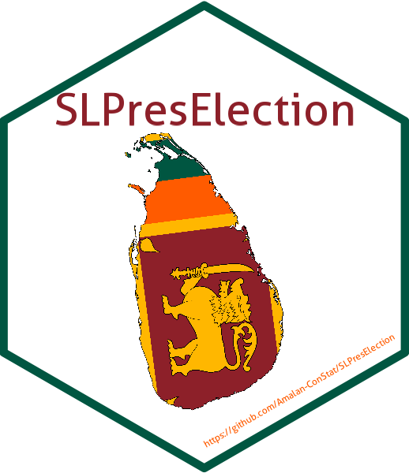

<!-- README.md is generated from README.Rmd. Please edit that file -->

```{r setup, include=FALSE}
knitr::opts_chunk$set(echo = TRUE,comment = "#>",collapse = TRUE, fig.retina=2, fig.path = "man/figures/",
                      out.width = "100%",warning = FALSE,message = FALSE)
library(badger)
```

# SLPresElection 

<!-- badges: start -->


`r badge_cran_release("SLPresElection")`
`r badge_cran_checks("SLPresElection")`
`r badge_runiverse()`

`r badge_cran_download("SLPresElection", "grand-total", "green")`
`r badge_cran_download("SLPresElection", "last-month", "green")`
`r badge_cran_download("SLPresElection", "last-week", "green")`

`r badge_repostatus("Active")`
`r badge_lifecycle("stable")`
[](https://github.com/Amalan-ConStat/SLPresElection/issues)

[](https://app.codecov.io/gh/Amalan-ConStat/SLPresElection?branch=main)
`r badge_codefactor("Amalan-ConStat/SLPresElection")`
`r badge_code_size("Amalan-ConStat/SLPresElection")`

[](https://lbesson.mit-license.org/)
<!-- badges: end -->

## How to engage with "SLPresElection" the first time ? 

```{r SLPresElection from GitHub or CRAN,eval=FALSE}
## Installing the package from GitHub
devtools::install_github("Amalan-ConStat/SLPresElection")

## Installing the package from CRAN
install.packages("SLPresElection")
```

## Key Phrases
* Presidential Election
* District
* Electorate
* Postal Votes
* Displaced Votes
* Total No of Valid Votes (Total Valid)
* No of Rejected Votes (Total Rejected)
* Total No of Votes Polled (Total Polled)
* No of Registered Electors (Total Registered)

```{r Load,quietly = TRUE}
#Load necessary packages
library(SLPresElection); library(ggplot2); library(dplyr); 
library(viridisLite); library(ggthemr); ggthemr("flat dark")
```

## What does "SLPresElection" ?

The seven presidential election results of Sri Lanka from 1982 to 2015 are available in the election commission [website as pdf files](https://elections.gov.lk/web/en/elections/elections-results/presidential-elections-results/).
However, through pdf scraping these results are available as csv files because of [my pet project](https://github.com/Amalan-ConStat/PresidentialElection). 
These csv files are available as data-frames in this R package.

Something to ponder on the tables in these pdf files
1. Total Polled = Total Valid + Total Rejected
2. Total Valid = Votes casted to Candidate $A$ + $...$ + Votes casted to Candidate $Z$
3. Total Polled $%$ = (Total Polled/ Total Registered) * $100$ 
4. Total Valid $%$ = (Total Valid/ Total Polled) * $100$
5. Total Rejected $%$ = (Total Rejected/ Total Polled) * $100$
6. Candidate $i$ $%$ = (Candidate A/ Total Polled ) *$100$

## Just a glimpse

```{r Registered_and_Polled_Votes,fig.width=12,fig.height=8,quietly = TRUE}
Election1982 %>% 
  subset(ColNames=="No of Registered Electors" & Electorate=="Final District Results"| 
         ColNames=="Total No of Votes Polled" & Electorate=="Final District Results")  %>% 
  group_by(District,ColNames) %>%
  summarise(Votes=sum(Votes)/100000) %>%
  ungroup(District,ColNames) %>%
  ggplot(.,aes(x=District,y=Votes,fill=ColNames,label=round(Votes,4)))+
  ylab("Votes (in 100,000)")+xlab("District")+
  geom_col(position = "dodge")+
  geom_text(vjust=-1,size=3)+
  theme(legend.position = "bottom",
        axis.text.x = element_text(angle=45,vjust=1.2,hjust=1.1))+
  scale_fill_viridis_d()+
  ggtitle("For 1982 the registered and polled votes for all districts")

```

```{r All seven elections,quietly = TRUE}
Final_Data<-rbind.data.frame(Election1982,Election1988,
                             Election1994,Election1999,
                             Election2005,Election2010,Election2015)
years<-unique(Final_Data$Year)
```

```{r Registered_and_Polled_Votes_over_the_years,fig.width=12,fig.height=8,quietly = TRUE}
Final_Data %>%
  subset(ColNames=="No of Registered Electors" & Electorate=="Final District Results" | 
           ColNames=="Total No of Votes Polled" & Electorate=="Final District Results") %>%
  group_by(Year,ColNames) %>%
  summarise(Votes=sum(Votes)/100000) %>%
  ungroup(Year,ColNames) %>%
  ggplot(.,aes(Year,Votes,color=ColNames,label=Votes))+
  ylab("Votes (in 100,000)")+
  geom_point(size=3.5)+geom_line(linewidth=2)+
  geom_text(vjust=-1.25,size=4)+
  scale_x_continuous(breaks = years)+
  theme(legend.position = "bottom")+scale_color_viridis_d()+
  ggtitle("The registered and polled votes for all seven elections")
```

```{r Rejected_Votes_over_the_years,fig.width=8,fig.height=6,quietly = TRUE}
Final_Data %>%
  subset(ColNames=="No of Rejected Votes" & Electorate=="Final District Results") %>%
  group_by(Year,ColNames) %>%
  summarise(Votes=sum(Votes)/100000) %>%
  ungroup(Year,ColNames) %>%
  ggplot(.,aes(Year,Votes,label=Votes))+
  geom_col()+geom_text(vjust=1)+
  ylab("Votes (in 100,000)")+
  scale_x_continuous(breaks = years)+
  theme(legend.position = "bottom")+scale_color_viridis_d()+
  ggtitle("No of Rejected Votes Over the Years")
```

## Conclusion

Complete information about how the data was scraped from the pdf files are available at the github repository [Presidential Election Data](https://github.com/Amalan-ConStat/PresidentialElection).
Read this blog post ["Extract Presidential Election Data of 2015 from the Pdf file"](https://amalan-con-stat.netlify.app/post/slelection/presidential-election/2015/2015/) for a clear picture of how to scrape the data from pdf files.
Results of all elections occured in Sri Lanka are available at the [Election Commission website](https://elections.gov.lk/)

#### Thank You

[](https://twitter.com/intent/tweet?text=Wow:&url=https%3A%2F%2Fgithub.com%2FAmalan-ConStat%2FSLPresElection)

[  ]( https://www.linkedin.com/in/amalan-mahendran-72b86b37/)
[  ]( https://www.researchgate.net/profile/Amalan_Mahendran )
